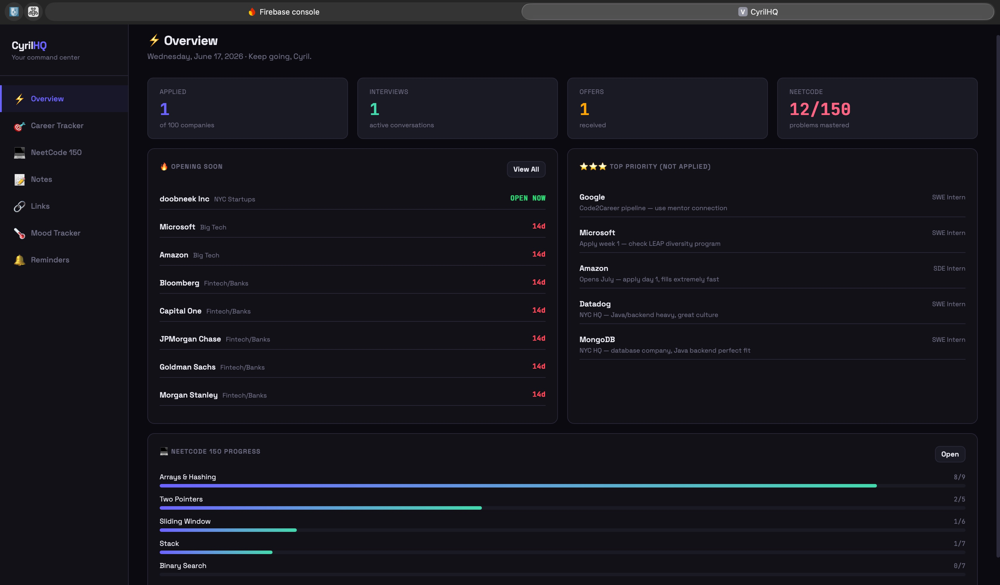
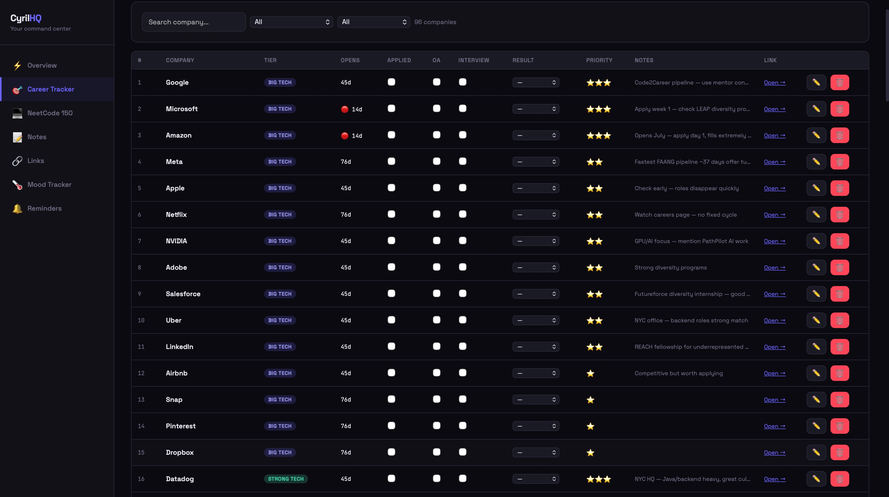
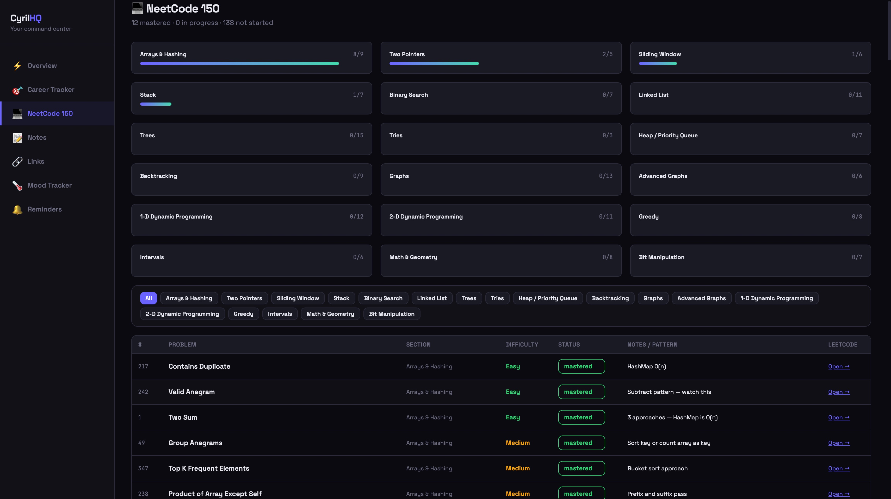

# CyrilHQ — Your Personal Command Center

> Built by [Cyril Annoh](https://www.linkedin.com/in/cyril-annoh/) · If you use this, tag me on LinkedIn for credit 🙏

This was created to help students with summer recruitment prep instead of having to do it all in an Excel spreadsheet.

A full-stack personal dashboard for CS students in internship recruiting season.
Built for my own Summer 2027 recruiting grind — feel free to fork and make it yours.

## Features
- 🎯 **Career Tracker** — 97 companies pre-loaded, track Applied/OA/Interview/Result, add new companies, opening date countdown
- 💻 **NeetCode 150 Tracker** — Track all 150 NeetCode problems, mark mastered/in progress, add pattern notes
- 📝 **Notes** — Capture DSA patterns, ideas, follow-ups by tag
- 🔗 **Links** — Save important career/DSA/project links
- 🌡️ **Mood Tracker** — Daily check-ins
- 🔔 **Reminders** — Send yourself rich HTML email reminders, schedule future ones
- 📧 **Auto Emails** — Daily NeetCode reminder (9am ET) + Weekly digest (Monday 8am ET)

## Screenshots

**Overview** — your daily snapshot: applied/interviews/offers, what's opening soon, top priority companies, and NeetCode progress at a glance.

**Career Tracker** — every company in one table, with status checkboxes, countdown to opening, priority stars, and editable notes.

**NeetCode 150 Tracker** — all 150 problems organized by section, with progress bars and per-problem pattern notes.

## What this isn't
This is a personal tool, not a SaaS product. There's no multi-user login, no real database (everything lives in your browser's localStorage), and email scheduling is in-memory (resets if the backend restarts). If you want something more robust, fork it and build on top — that's the whole point.

Company career page links may change or break over time — if one stops working, just search the company's name + "careers" or go straight to their main careers page.

## How Data Actually Works (read this before you get confused)

This trips people up, so here's the short version: **`companies.js` is the starting seed data, not a live source.**

When the app loads for the first time in your browser, it copies everything from `companies.js` into your browser's **localStorage**. After that, the app reads and writes from localStorage only — not from the file anymore.

This means:
- **If you edit `companies.js` in code and push it, your own browser won't see the change** until you clear localStorage for the site and reload (see below). Otherwise your browser keeps showing the old cached version.
- **If you add/edit a company through the UI** (the pencil icon, "Add Company" button, checking off Applied/OA/Interview), that change only lives in your browser's localStorage. It does **not** get written back into `companies.js`. If you `git push` afterward, that UI-added company won't be in your repo — it only exists in your local browser session.
- **Email reminders DO include UI-added companies.** The backend reads whatever's currently in your dashboard's live data (including localStorage-only entries), not a frozen snapshot of the file. So if you add a company through the UI, it'll show up in your "Opening Soon" emails just like the pre-loaded ones.

**To force your browser to re-sync with an updated `companies.js`:**
1. Open the dashboard in your browser
2. Open DevTools (Cmd+Option+I on Mac, F12 on Windows)
3. Go to the **Console** tab, type `localStorage.clear()`, hit enter
4. Refresh the page

Heads up: this wipes everything stored locally for the site, not just companies — Notes, Links, Mood Tracker entries, and any Applied/OA/Interview checkboxes you've already clicked. If you've got data you don't want to lose, write it down before clearing.

## No Java or Spring Boot experience?
Don't let that stop you. Use AI (Claude, ChatGPT, whatever you've got) to help you read through the code and get it running, the codebase is pretty straightforward and well-commented. And if you genuinely get stuck, feel free to message me directly. I'd rather help you fix it than have you give up on it.

**Good luck on your SWE search.**

---

## Personalize It First (Manual Steps)

Before running, update these to match your info:

**1. Your email** — search and replace `cyrrilann@gmail.com` with your own email across:
- `backend/src/main/java/com/dashboard/controller/ReminderController.java`
- `backend/src/main/java/com/dashboard/scheduler/WeeklyDigestScheduler.java`
- `frontend/src/components/Reminders.jsx`

**2. Your companies** — `frontend/src/data/companies.js` has 97 companies pre-loaded for a NYC CS student. Clear them out and add your own targets, or keep them as a starting point. Remember: editing this file only affects *new* browsers/sessions that haven't loaded the app yet — see "How Data Actually Works" above if your own browser doesn't reflect changes.

**3. Your NeetCode progress** — same file (`companies.js`), scroll to the `NEETCODE_150` export. It follows the official NeetCode 150 list with correct LeetCode problem numbers. Update each `status` field to reflect what you've already solved: `"not started"`, `"in progress"`, or `"mastered"`.

**4. Weekly email links** — `WeeklyDigestScheduler.java` has company links specific to my recruiting targets. Swap them for yours.

**5. Resend API key** — emails are sent via [Resend](https://resend.com) (free tier) instead of raw SMTP, because most hosts (Railway, Render, etc.) block outbound SMTP. Sign up with the email you want to send/receive from, grab an API key, and set it as `RESEND_API_KEY` in your environment.

---

## Setup

### Prerequisites
- Node.js 18+
- Java 21
- Maven

### 1. Frontend
\`\`\`bash
cd frontend
npm install
npm run dev
\`\`\`
Opens at http://localhost:5173

### 2. Backend (Email via Resend)

1. Sign up at [resend.com](https://resend.com) using the email you want reminders sent from/to
2. Grab your API key from the dashboard
3. Set it as an environment variable:
\`\`\`bash
export RESEND_API_KEY=re_your_key_here
\`\`\`

**Run the backend:**
\`\`\`bash
cd backend
export JAVA_HOME=/opt/homebrew/opt/openjdk@21
mvn spring-boot:run
\`\`\`
Runs on http://localhost:8080

### 3. Test it works
Visit http://localhost:8080/api/reminders/health → should return `{ "status": "CyrilHQ backend running ✅" }`

---

## Deploy to Vercel (Frontend)

\`\`\`bash
cd frontend
npm run build
\`\`\`
Push to GitHub → connect to Vercel → set **Root Directory** to `frontend` → deploy.

Set environment variable in Vercel (apply to all environments, including Production):
\`\`\`
VITE_BACKEND_URL=https://your-backend-url.com
\`\`\`

## Deploy Backend (Railway)

Push to GitHub → connect Railway → set **Root Directory** to `backend` → add environment variable:
\`\`\`
RESEND_API_KEY=re_your_key_here
\`\`\`
Railway auto-detects Maven and builds it. Note: Railway blocks outbound SMTP, which is exactly why this uses Resend's HTTP API instead of JavaMailSender.

---

## Data Persistence
All data (companies, notes, links, mood) is saved in **localStorage**  it persists across sessions in the same browser. No database required for the frontend. See "How Data Actually Works" above for details on how this interacts with `companies.js`.

Email scheduling uses an in-memory scheduler — scheduled reminders are lost if the backend restarts before they fire. Fine for a personal tool, not production-grade.

---

## License
This project is released under the **MIT License** — a standard open-source license that means: you're free to use, copy, modify, and distribute this code for any purpose, including commercially, with no restrictions. The only requirement is that the original copyright notice stays in the code somewhere. In plain terms: do whatever you want with it, no permission needed. A LinkedIn tag is appreciated but not required.

*Built by Cyril Annoh · NYC College of Technology (CUNY) · CS Student · Bronx, NY*
*Questions or stuck on setup? Message me on [LinkedIn](https://www.linkedin.com/in/cyril-annoh/) — happy to help.*
