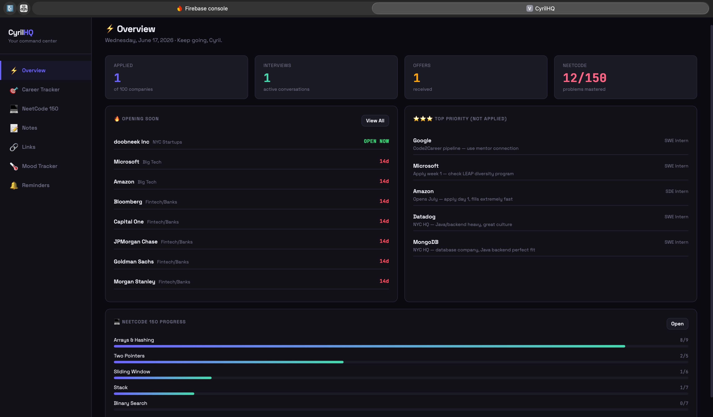
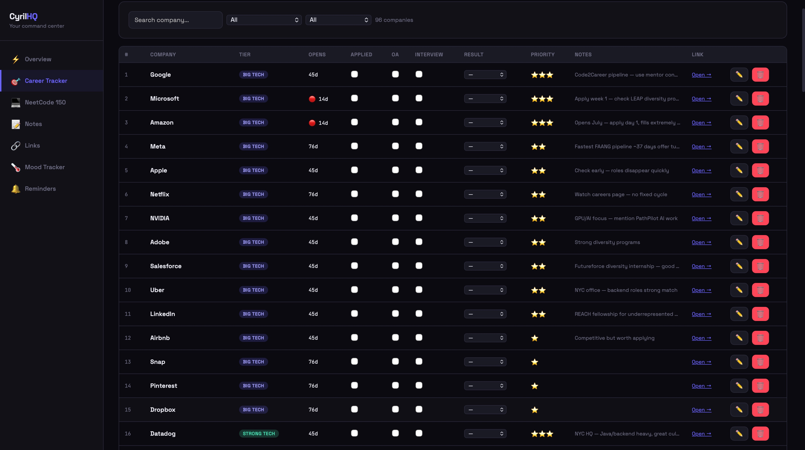
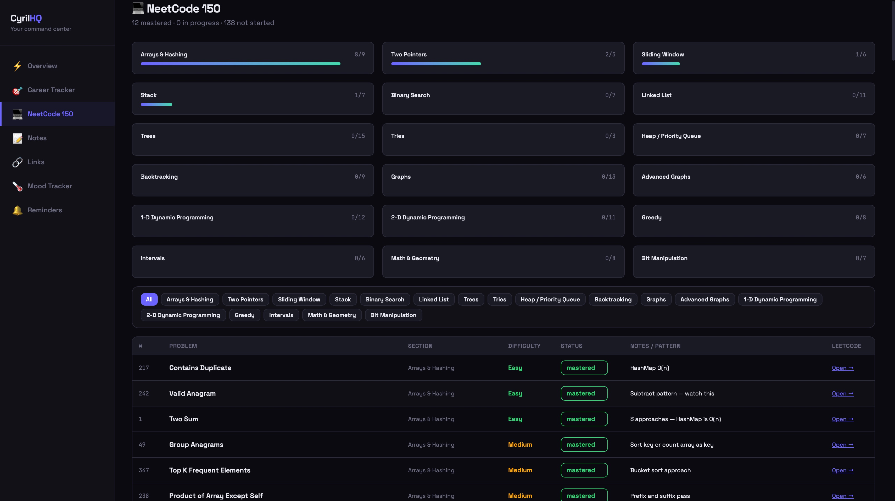

# InternshipTracker — Your Personal Command Center

> Forked from and based on the original [Cyril-Recruiting-dashboard](https://github.com/Cyrila7/Cyril-Recruiting-dashboard).

This was created to help students with summer recruitment prep instead of having to do it all in an Excel spreadsheet.

A full-stack personal dashboard for CS students in internship recruiting season.
Built for my own Summer 2027 recruiting grind — feel free to fork and make it yours.

## Features
- 🎯 **Career Tracker** — 200+ companies pre-loaded (compiled from multiple sources, see [Data Sources](#data-sources)), track Applied/OA/Interview/Result, add new companies, opening date countdown
- 💻 **NeetCode 150 Tracker** — Track all 150 NeetCode problems, mark mastered/in progress, add pattern notes
- 📝 **Notes** — Capture DSA patterns, ideas, follow-ups by tag
- 🔗 **Links** — Save important career/DSA/project links
- 🌡️ **Mood Tracker** — Daily check-ins
- 🔔 **Reminders** — Send yourself HTML email reminders, schedule future ones
- 📧 **Auto Emails** — Daily NeetCode reminder (9am ET) + Weekly digest (Monday 8am ET)

## Screenshots

**Overview** — your daily snapshot: applied/interviews/offers, what's opening soon, top priority companies, and NeetCode progress at a glance.

**Career Tracker** — every company in one table, with status checkboxes, countdown to opening, priority stars, and editable notes.

**NeetCode 150 Tracker** — all 150 problems organized by section, with progress bars and per-problem pattern notes.

## What this isn't
This is a personal tool, not a SaaS product. There's no multi-user login — all data is global to whoever runs the backend. Email scheduling is still in-memory and resets if the backend restarts. If you want something more robust, fork it and build on top.

Company career page links may change over time. If one breaks, search the company name + "careers" or go straight to their main careers page.

## Data Sources
The company list started as 97 hand-picked companies, then got merged with a second, actively-maintained list to get broader/fresher coverage instead of relying on one source:

- **Base list (97 companies):** hand-picked across Big Tech, Fintech/Banks, NYC Startups, Well-Funded Startups, and Great Targets tiers.
- **Merged in from [sndsh404/summer-2027-internships](https://github.com/sndsh404/summer-2027-internships):** a community-maintained list of real, currently-open Summer 2027 postings with direct apply links and posted dates. Added 107 new company/role entries (67 companies not already tracked), which introduced a new **Quant/Trading** tier since a large share of that list is quant trading firms (Optiver, Two Sigma, IMC Trading, Susquehanna, etc.).
- **Dedup approach:** entries were matched by company name against the existing 97. Brand-new companies were merged in directly; companies that already existed in the base list but had a different specific role in the second source were *not* auto-merged — they were set aside in `DUPLICATES_TO_REVIEW.md` for manual review (to avoid guessing whether a specific req is more current than the existing placeholder entry).
- **Known pre-existing dupes fixed:** Ramp and Brex each had duplicate entries across two tiers in the original 97; resolved to keep the Fintech/Banks tier version.
- To pull in fresher data from that source later, re-run the same merge process (parse its README table, dedup against current company list by normalized name, insert only new companies, log the rest to a review file).

## How Data Works
**Data lives in a real database now, served by the Spring Boot backend.** This fork replaced the old browser-`localStorage` storage with a persistent database, so your companies, NeetCode progress, notes, links, mood logs, and reminder history survive across browsers, devices, and restarts.

- **Default DB:** [H2](https://www.h2database.com) in file mode — zero install, persists to `backend/data/internshiptracker.mv.db`. The file is created automatically on first run and is git-ignored.
- **First run only:** the backend seeds the 200+ companies, 150 NeetCode problems, and default links (from `backend/src/main/resources/seed/*.json`) into the database — but only if the tables are empty. Your edits afterward live in the DB and are never overwritten.
- **The frontend talks to the backend over a small REST API** (`frontend/src/api.js`); each tab loads its data on open and writes changes through `/api/...` endpoints. The Vite dev server proxies `/api` to `http://localhost:8080`.
- **`frontend/src/data/companies.js` is no longer read by the app** — it remains only as the source the seed JSON was generated from.
- **Switching to PostgreSQL** (e.g. on Railway/Render) needs no code changes: set `DATABASE_URL`, `DATABASE_USERNAME`, and `DATABASE_PASSWORD` env vars and the backend uses them automatically (the Postgres driver is already bundled). See `backend/src/main/resources/application.properties`.

### REST API
`GET/POST` `/api/{resource}` and `GET/PUT/DELETE` `/api/{resource}/{id}` for each of:
`companies`, `neetcode`, `notes`, `links`, `mood`, `reminder-log`. In dev you can inspect the DB directly at `http://localhost:8080/h2-console` (JDBC URL `jdbc:h2:file:./data/internshiptracker`, user `sa`, no password).

## No Java or Spring Boot experience?
Don't let that stop you. Use AI (Claude, ChatGPT, whatever you've got) to help read through the code and get it running. The codebase is straightforward and well-commented.

**Good luck on your SWE search.**

---

## Personalize It First

Before running, update these to match your info:

**1. Your email (most important)** — reminders are sent to `abbadsiddiqui1@gmail.com`. To change it, search and replace that address with your own across:
- `backend/src/main/java/com/dashboard/controller/ReminderController.java`
- `backend/src/main/java/com/dashboard/scheduler/WeeklyDigestScheduler.java`
- `frontend/src/components/Reminders.jsx`

**2. Your companies** — the 200+ pre-loaded companies (see [Data Sources](#data-sources)) live in `backend/src/main/resources/seed/companies.json` and are seeded into the database on first run. Add/edit/delete companies right in the UI (changes persist to the DB). To change the *initial* seed, edit that JSON before your first run, or wipe `backend/data/` to reseed from scratch.

**3. Your NeetCode progress** — just click each problem's status in the UI to cycle `"not started"` → `"in progress"` → `"mastered"`; it saves to the DB. The initial seed is `backend/src/main/resources/seed/neetcode.json`.

**4. Weekly email links** — `WeeklyDigestScheduler.java` has company links specific to my targets. Swap them for yours.

**5. Resend API key** — emails go through [Resend](https://resend.com) (free tier) instead of raw SMTP, because most hosts block outbound SMTP. Sign up with the email you want to send from, grab an API key, and set it as `RESEND_API_KEY` in your environment.

---

## Setup

### Prerequisites
- Node.js 18+
- Java 21
- Maven

### 1. Frontend
\`\`\`bash
cd frontend
npm install
npm run dev
\`\`\`
Opens at http://localhost:5173

### 2. Backend (data API + email)

> **The backend is required.** This fork stores data in a database, so the app loads everything from the backend — start it first, then the frontend. On first run it creates the H2 database file under `backend/data/` and seeds the companies, NeetCode problems, and links automatically (no database to install).

**Email is optional** — the app runs fine without it; only reminder *sending* needs it. To enable email:

1. Sign up at [resend.com](https://resend.com) using the email you want reminders sent from/to
2. Grab your API key from the dashboard
3. Set it as an environment variable:
\`\`\`bash
export RESEND_API_KEY=re_your_key_here
\`\`\`

**Run the backend:**
\`\`\`bash
cd backend
mvn spring-boot:run
\`\`\`
Runs on http://localhost:8080

> **Note (Java 21):** Apple Silicon Macs: `export JAVA_HOME=/opt/homebrew/opt/openjdk@21`. Intel Macs (Homebrew under `/usr/local`): `export JAVA_HOME=/usr/local/opt/openjdk@21`. On Windows/Linux, just make sure Java 21 is on your PATH.

### 3. Test it works
Visit http://localhost:8080/api/reminders/health and you should get `{ "status": "InternshipTracker backend running ✅" }`

---

## Deploy to Vercel (Frontend)

\`\`\`bash
cd frontend
npm run build
\`\`\`
Push to GitHub, connect to Vercel, set **Root Directory** to `frontend`, and deploy.

Add this environment variable in Vercel (apply to all environments including Production):
\`\`\`
VITE_BACKEND_URL=https://your-backend-url.com
\`\`\`

## Deploy Backend (Railway)

Push to GitHub, connect Railway, set **Root Directory** to `backend`, and add:
\`\`\`
RESEND_API_KEY=re_your_key_here
\`\`\`
Railway auto-detects Maven and builds it. Railway blocks outbound SMTP, which is why this uses Resend's HTTP API instead of JavaMailSender.

---

## Data Persistence
All data (companies, NeetCode progress, notes, links, mood, reminder history) is stored in a database via the Spring Boot backend and persists across browsers, devices, and restarts. Defaults to file-based H2 with zero setup; swappable to PostgreSQL via env vars. See "How Data Works" above for details.

Email scheduling is in-memory. Scheduled reminders are lost if the backend restarts before they fire. Fine for a personal tool, not production-grade.

---

## License
MIT License. You're free to use, copy, modify, and distribute this code for any purpose with no restrictions. The only requirement is that the original copyright notice stays in the code somewhere.

*Based on the original [Cyril-Recruiting-dashboard](https://github.com/Cyrila7/Cyril-Recruiting-dashboard).*